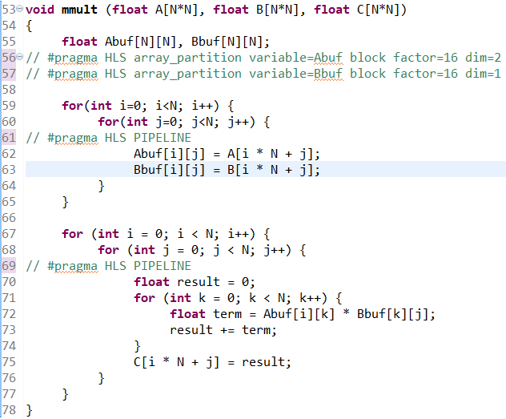
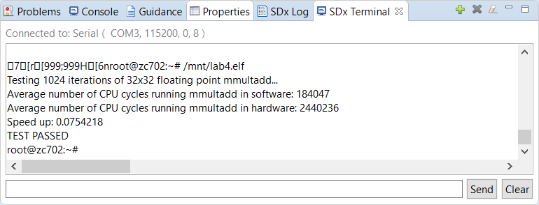

<table style="width:100%">
  <tr>
    <th width="100%" colspan="6"><h1>SDSoC 環境チュートリアル: 概要</h1>
</th>
  </tr>
  <tr>
    <td align="center"><a href="README.md">概要</a></td>
    <td align="center"><a href="lab-1-introduction-to-the-sdsoc-development-environment.md">演習 1: SDSoC 開発環境の概要</a></td>
    <td align="center"><a href="lab-2-performance-estimation.md">演習 2: パフォーマンスの見積もり</a></td>
    <td align="center"><a href="lab-3-optimize-the-application-code.md">演習 3: アプリケーション コードの最適化</a></td>
    <td align="center">演習 4: 指示子を使用したアクセラレータの最適化</td>
  </tr>
  <tr>
    <td align="center"><a href="lab-5-task-level-pipelining.md">演習 5: タスク レベルのパイプライン</a></td>
    <td align="center"><a href="lab-6-debug.md">演習 6: デバッグ</a></td>
    <td align="center"><a href="lab-7-hardware-debug.md">演習 7: ハードウェア デバッグ</a></td>
    <td align="center"><a href="lab-8-emulation.md">演習 8: エミュレーション</a></td>
    <td align="center"><a href="lab-9-installing-applications-from-github.md">演習 9: GitHub からのサンプルのインストール</a></td>
</table>

## 演習 4: 指示子を使用したアクセラレータの最適化  

この演習では、プロジェクト内のソースを変更して、生成したハードウェアのパフォーマンスへの Vivado HLS プラグマの影響について確認します。このトピックの詳細は、『SDSoC 環境プロファイルおよび最適 ガイド』 ([UG1235](https://japan.xilinx.com/cgi-bin/docs/rdoc?v=2018.2;d=ug1235-sdsoc-optimization-guide.pdf)) を参照してください。  

  1. [Matrix Multiplication and Addition] デザイン テンプレートを使用して、[ZC702 Platform] および [Linux] システム コンフィギュレーションで新しい SDx™ 環境プロジェクト (lab4) を作成します。  

  2. [lab4] タブをクリックして [SDx Project Settings] を開きます。タブが表示されていない場合は、[Project Explorer] タブの [lab4] プロジェクトの下の `project.sdx` ファイルをダブルクリックします。  

  3. [HW functions] パネルには、`madd` および `mmult` 関数がハードウェア アクセラレーション用にマークされた関数のリストに表示されます。

  4. 最高のランタイム パフォーマンスにするには、[Active Build Configuration] オプションをクリックして [Release] を選択して [Release] コンフィギュレーションに切り替えます。または、[Build] アイコンから [Release] を選択するか、プロジェクトを右クリックして [Build Configuration] → [Set Active] → [Release] をクリックします。[Release] ビルド コンフィギュレーションでは、[Debug] ビルド コンフィギュレーションよりも高いコンパイラ最適化設定が使用されます。  

  5. [Project Explorer] タブで `src` フォルダー下の `mmult.cpp` をダブルクリックして、ソース エディター ビューを開きます。  

  6. `HLS pipeline` および `HLS array_partition` プラグマが記述されている行を見つけます。

  7. これらのプラグマの行をコメントアウトします。  

       

  8. ファイルを保存します。  

  9. プロジェクトの最上位フォルダーを右クリックして、[Build Project] をクリックします。

  10. ビルドが終了したら、`lab4/Release/sd_card` の内容を SD カードにコピーします。  

  11. SD カードを ZC702 ボードに挿入し、ボードに電源を投入します。  

  12. SDx IDE の [Terminal] タブのシリアル ターミナルからボードに接続します。**+** アイコンをクリックして設定を開きます。  

  13. ボードが起動したら、Linux プロンプトでアプリケーションを実行します。`/mnt/lab4.elf` と入力します。  

プラグマがコメントアウトされていたときのパフォーマンスと比較すると (lab1 の結果と比較すると)、`array_partition` プラグマにより配列の要素を並列に読み出せるようになったので、内部ループのメモリ帯域幅が増加したことがわかります。pipeline プラグマでは、ループのパイプライン処理が実行され、ループの複数の反復が並列に実行されるようなったことがわかります。  

Copyright&copy; 2018 Xilinx

この資料は表記のバージョンの英語版を翻訳したもので、内容に相違が生じる場合には原文を優先します。資料によっては英語版の更新に対応していないものがあります。日本語版は参考用としてご使用の上、最新情報につきましては、必ず最新英語版をご参照ください。