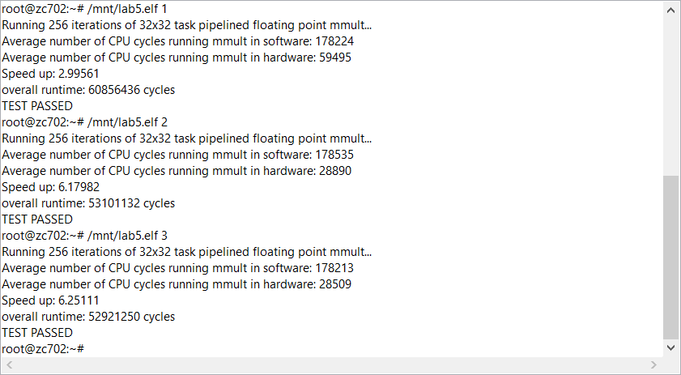

<a href="../../getting-started-tutorial/README.md">English</a> | <a>日本語</a>

<table style="width:100%">
  <tr>
<td align="center" width="100%" colspan="6"><h1>2018.3 SDSoC™ 開発環境チュートリアル</h1>
<a href="https://github.com/Xilinx/SDSoC-Tutorials/branches/all">ほかのバージョンを参照</a>
</td>
  </tr>
  <tr>
    <td colspan="5" align="center"><h2>概要</h2></td>
  <tr>
    <td align="center"><a href="README.md">概要</a></td>
    <td align="center"><a href="lab-1-introduction-to-the-sdsoc-development-environment.md">演習 1: SDSoC 開発環境の概要</a></td>
    <td align="center"><a href="lab-2-performance-estimation.md">演習 2: パフォーマンスの見積もり</a></td>
    <td align="center"><a href="lab-3-optimize-the-application-code.md">演習 3: アプリケーション コードの最適化</a></td>
    <td align="center"><a href="lab-4-optimize-the-accelerator-using-directives.md">演習 4: 指示子を使用したアクセラレータの最適化</a></td>
  </tr>
  <tr>
    <td align="center">演習 5: タスク レベルのパイプライン</td>
    <td align="center"><a href="lab-6-debug.md">演習 6: デバッグ</a></td>
    <td align="center"><a href="lab-7-hardware-debug.md">演習 7: ハードウェア デバッグ</a></td>
    <td align="center"><a href="lab-8-emulation.md">演習 8: エミュレーション</a></td>
    <td align="center"><a href="lab-9-installing-applications-from-github.md">演習 9: GitHub からのサンプルのインストール</a></td>
    </tr>
</table>

## 演習 5: タスク レベルのパイプライン  

この演習では、SDx IDE で生成されたハードウェア/ソフトウェア システムをタスク レベルのパイプライン処理を使用して最適化するためにコードを変更する方法について説明します。パイプライン処理のパフォーマンスに対する影響を確認します。  

>**:pushpin: 注記:**  このチュートリアルは、ZC702 ボードがなくても終了できます。SDSoC 環境プロジェクトを作成する際に、ボードを選択してください。このチュートリアルでは、ZC702 のアプリケーション用に作成されたソース ファイルを追加するように記述されています。ボードにより小型の Zynq-7000 デバイスが含まれる場合は、ソース ファイルを追加した後に mmult_accel.cpp ファイルを編集して、リソース使用率を減らしてください。たとえば、アクセラレータ ソース ファイルの場合は、`#pragma_HLS_array_partition` で `block factor=16` と設定されていますが、`block factor=8` と設定します。  

<strong>タスクのパイプライン処理</strong>

アプリケーションにアクセラレータへの呼び出しが複数ある場合、これらの呼び出しをパイプライン処理して、設定およびデータ通信とアクセラレータ計算が並列処理されるように構成できます。行列乗算アプリケーションの場合は、次のイベントが実行されます。  

  1. 行列 A と B がメイン メモリからアクセラレータのローカル メモリに転送されます。  
  2. アクセラレータが実行されます。  
  3. 結果 C がアクセラレータからメイン メモリに戻されます。  

次の図の左側に行列乗算デザイン、右側に順次実行される連続した 2 つの呼び出しに対するこれらのイベントのタイムチャートを示します。  

    

次の図に、これら 2 つの呼び出しをパイプライン処理して実行した場合を示します。2 番目の呼び出しのデータ転送は、最初の呼び出しのデータ転送が終わるとすぐに開始し、最初の呼び出しの実行と同時に実行されます。ただし、パイプライン処理をイネーブルにするには、アクセラレータが 1 つ目の引数セットを使用して計算を実行している間、2 番目の引数セットを格納しておくローカル メモリが必要です。SDSoC 環境では、ユーザーの指定に基づき、このためにマルチバッファーと呼ばれるメモリが生成されます。  

    

タスク レベルのパイプライン処理を指定するには、async(id) および wait(id) プラグマを使用して呼び出しコードを記述し直す必要があります。SDSoC 環境には、async プラグマの使用方法を示すサンプルが含まれており、このチュートリアルではこの行列乗算パイプライン処理のサンプルを使用します。  

<strong>行列乗算サンプルでのタスクのパイプライン処理</strong>

SDx IDE には、タスク レベルのパイプライン処理をインプリメントする async プラグマの使用方法を示す行列乗算のパイプライン処理のサンプルが含まれています。この演習では、この手法を使用することによるランタイムの向上を確認します。

  1. [File] → [New] → [SDx Project] をクリックし、新しい SDx プロジェクト (`lab5`) を作成します。[Project name] に `lab5` と入力し、[Platform] に [zc702]、[System Configuration] に [Linux] を選択して [Next] をクリックします。  

  2. 選択したプラットフォーム用のソース コード例をリストする [Templates] ページが表示されます。[Available Templates] から [Empty Application] を選択し、[Finish] をクリックします。  

  3. 使用しているオペレーティング システムのファイル マネージャーを使用し `<path to install>/SDx/2018.2/samples/mmult_pipelined` を開き、そのディレクトリにあるソース ファイル (`mmult_accel.cpp`、`mmult_accel.h`、`mmult.cpp`) を作成したプロジェクトの `src` フォルダー (例: `./lab5/src`) にコピーします。  

  4. SDx で [lab5] をクリックして、コンテキスト メニューから [Refresh] をクリックします。これで前の段階でコピーしたすべてのソースがプロジェクトに追加されます。  

  5. ビルド コンフィギュレーションを [Release] に変更します。  

  6. `mmult_accel.cpp` ファイルの `mmult_accel` 関数を、[SDx Project Settings] で [Add HW Functions] アイコンをクリックするか、[Project Explorer] タブで右クリックして [Toggle HW/SW] をクリックしてマークします。  

  7. プロジェクトをビルドします。  

  8. `sd_card` フォルダーのファイルを SD カードにコピーし、ターミナルを設定して、ボード上で生成されたアプリケーションを実行します。アプリケーションの引数としてパイプライン段数を指定する必要があります。パイプラン段数を 1、2、および 3 に設定してアプリケーションを実行し、パフォーマンスを記録します。  

### まとめ

このチュートリアルを終了すると、次ができるようになります。

  * SDx IDE 環境を使用してタスク レベルのパイプライン処理を実行することにより、アプリケーションを実行時間を短縮するよう最適化。  
  * アクセラレータでの計算と入力および出力通信を同時に実行するアクセラレータへのパイプライン呼び出しのパフォーマンスに対する影響を確認。  

Copyright&copy; 2019-2019 Xilinx

この資料は表記のバージョンの英語版を翻訳したもので、内容に相違が生じる場合には原文を優先します。資料によっては英語版の更新に対応していないものがあります。日本語版は参考用としてご使用の上、最新情報につきましては、必ず最新英語版をご参照ください。
