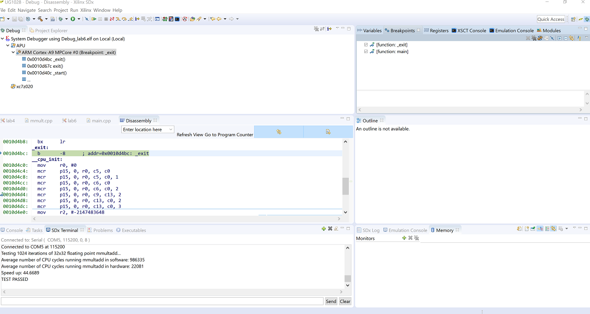

<table style="width:100%">
  <tr>
    <th width="100%" colspan="6"><h1>SDSoC 環境チュートリアル: 概要</h1>
</th>
  </tr>
  <tr>
    <td align="center"><a href="README.md">概要</a></td>
    <td align="center"><a href="lab-1-introduction-to-the-sdsoc-development-environment.md">演習 1: SDSoC 開発環境の概要</a></td>
    <td align="center"><a href="lab-2-performance-estimation.md">演習 2: パフォーマンスの見積もり</a></td>
    <td align="center"><a href="lab-3-optimize-the-application-code.md">演習 3: アプリケーション コードの最適化</a></td>
    <td align="center"><a href="lab-4-optimize-the-accelerator-using-directives.md">演習 4: 指示子を使用したアクセラレータの最適化</a></td>
  </tr>
  <tr>
    <td align="center"><a href="lab-5-task-level-pipelining.md">演習 5: タスク レベルのパイプライン</a></td>
    <td align="center">演習 6: デバッグ</td>
    <td align="center"><a href="lab-7-hardware-debug.md">演習 7: ハードウェア デバッグ</a></td>
    <td align="center"><a href="lab-8-emulation.md">演習 8: エミュレーション</a></td>
    <td align="center"><a href="lab-9-installing-applications-from-github.md">演習 9: GitHub からのサンプルのインストール</a></td>
</table>

## 演習 6: デバッグ  

このチュートリアルでは、SDx IDE でインタラクティブ デバッガーを使用する方法を示します。  

まず、デザインのターゲットをスタンドアロン オペレーティング システムまたはプラットフォームに設定し、SDx IDE を使用してスタンドアロン アプリケーションを実行して、アプリケーションをデバッグします。  

このチュートリアルでは、アクセラレーションされたシステムで実行しているアプリケーションをデバッグします。  

>**:pushpin: 注記:**  このチュートリアルは、ZC702 ボードがなくても終了できます。SDx プロジェクトを作成する際に、推奨されている [Matrix Multiplication and Addition] テンプレートが見つからない場合は、ボードと使用可能なアプリケーションの 1 つを選択してください。たとえば、より小型の Zynq-7000 デバイスを含む MicroZed ボードなどのボードの場合、使用可能なテンプレートに [Matrix Multiplication and Addition (area reduced)] アプリケーションがリストされます。このチュートリアルの学習目標は、どのアプリケーションでも達成できるようになっています。  

<strong>手順 1: ボードの設定</strong>

ボードの UART ポートに接続するには mini USB ケーブルが必要です。これにより SDx IDE のシリアル ターミナルに通信できるようになります。この接続は、アプリケーション ソフトウェアからの出力 (情報メッセージを含む) を確認するのに必要です。ボードの Digilent ポートに接続するには Micro USB ケーブルも必要で、これによりビットストリームおよびバイナリをダウンロードできます。この接続は、ターゲット ボードでアプリケーションが起動される際に FPGA をプログラムするために必要です。イーサネット ケーブルも必要です。Linux TCF エージェントには、ターゲット ボードと通信するのにイーサネット リンクが必要です。最後に、SD カードから起動できるように、SD カード スロットのサイドのジャンパーが正しく設定されているかどうか確認します。  

  1. mini USB ケーブルを UART ポートに接続します。  

  2. JTAG モードが Digilent ケーブルを使用するように設定されており、Micro USB ケーブルが接続されていることを確認します。  

         

  3. DIP スイッチ (上の図の赤丸) を SD ブート モードに設定します。SD カードは挿入しないでください。  

  4. ボードに電源を投入します。  

Windows で `USB-UART` ドライバーと `Digilent` ドライバーがインストールされるようにし、SDx IDE がボードと通信できるようにします。  

>**:information_source: 重要:** ボードのジャンパーが SD ブートまたは JTAG ブートに設定されていることを確認します。このようにしておかないと、ボードが QSPI ブートなどのその他のモードでパワーアップし、QSPI デバイスまたはその他のブート デバイスからこの演習に関係のないものが読み込まれてしまいます。

<strong>手順 2: Standalone プロジェクトの作成</strong>

  [Matrix Multiplication and Addition] デザイン テンプレートを使用して ZC702 プラットフォームおよびスタンドアロン OS の新しい SDx™ プロジェクト (lab6) を作成します。  

  SDx IDE でスタンドアロン プロジェクトを作成する手順は、次のとおりです。  

 1. SDx IDE が起動します。  
 2. [File] → [New] → [SDx Project] をクリックします。  
 3. [Project Type] ページでは、デフォルトで [Application Project] がオンになっています。[Next] をクリックします。  
 4. [Project name] フィールドにプロジェクト名を指定します (例: lab6)。[Next] をクリックします。  
 5. [Platform] から [zc702] を選択します。[Next] をクリックします。  
 6. [System Configuration] ドロップダウン リストから [Standalone] を選択します。[Next] をクリックします。  
 7. [Available Templates] のリストから [Matrix Multiplication and Addition] を選択し、[Finish] をクリックします。  
 8. [lab6] タブをクリックし (タブが表示されていない場合は [Project Explorer] ビューで project.sdx ファイルをダブルクリック)、[SDx Project Settings] の [HW functions] パネルで `mmult` および `madd` 関数がハードウェア関数としてマークされていることを確認します。  
 9. ハードウェア関数としてマークされていない場合は、[Add HW Functions] ボタン  をクリックしてダイアログ ボックスを開き、ハードウェア関数としてマークします。[Matching items] リストで Ctrl キーを押しながら `mmult` と `madd` 関数をクリックして選択します。[OK] をクリックして、両方の関数を [Hardware Functions] セクションに追加します。  
 10. [Project Explorer] タブでプロジェクトを右クリックし、[Build Project] をクリックします。  
     SDx によりプロジェクトがビルドされます。ビルド プロセスのステータスを示すダイアログ ボックスが表示されます。  

<strong>手順 3: デバッグ コンフィギュレーションの設定</strong>

  デバッグ コンフィギュレーションを設定するには、次の手順に従います。  

  1. [Project Explorer] ビューで lab6 プロジェクトの Debug フォルダーに含まれる最上位プロジェクト (`lab6`) をクリックし、ツールバーの [Debug] ボタンをクリックするか、[Debug] ボタンのプルダウン メニューから [Debug As] → [Launch on Hardware (SDx Application Debugger)] をクリックします。または、プロジェクトを右クリックし、[Debug As] → [Launch on Hardware (SDx Application Debugger)] をクリックします。
     [Confirm Perspective Switch] ダイアログ ボックスが表示されます。  

   >**:information_source: 重要:**プロジェクトをデバッグする前にボードのスイッチがオンになっていることを確認してください。  

  2. [Yes] をクリックして [Debug] パースペクティブに切り替えます。  
     これで、SDx IDE が [Debug] パースペクティブになりました。デバッガーによりシステムがリセットされ、デバイスがプログラムおよび初期化され、`main` 関数で停止します。中央のパネルにソース コード、右上のパネルにローカル変数、右下のパネルに SDx ログが表示されます。  

  3. アプリケーションを実行する前に、シリアル ターミナルをボードに接続して、プログラムからの出力が表示されるようにする必要があります。[Connection Type]: Serial、[Port]: COM<n>、[Baud Rate]: 115200 ボーに設定します。  

<strong>手順 4: アプリケーションの実行</strong>

  [Resume] アイコン  をクリックしてアプリケーションを実行し、出力をターミナル ウィンドウで確認します。  

  >**:pushpin: 注記:**  ソース コード ウィンドウに `_exit` 関数が表示され、[Terminal] タブに行列乗算アプリケーションからの出力が表示されます。  

    

<strong>その他の演習</strong>

>**:pushpin: 注記:**  このセクションの手順は、オプションです。  

  アプリケーションを使用したデバッグ/ステップの方法、Linux アプリケーションのデバッグ方法について説明します。    

  

  
<strong>コードのステップ スルー</strong>
  

  [Debug] パースペクティブには、この演習では説明しなかったその他多くの機能が含まれます。最も重要なのは、デバッグするコードをステップ スルーする機能です。  

  1. lab6 の [Debug] ビュー (Debug_lab6.elf を使用した System Debugger) でデバッグ階層を右クリックし、[Disconnect] をクリックします。  
  2. 最上位のデバッグ フォルダーをもう 一度右クリックして、[Remove all Terminated] をクリックします。  
  3. バグ アイコンをクリックしてデバッガーを起動し、[step-into]、[step-over]、[step-return] ボタンを使用してコードをステップ スルーします。  
  4. コードをステップ スルーしながら、さまざまな変数の値を確認します。  

  

  

  
<strong>Linux アプリケーションのデバッグ</strong>

  SDSoC 環境で Linux アプリケーションをデバッグするには、次の手順に従います。  

  1. プロジェクトを作成し (例: lab6_linux)、[Platform] に [zc702] を、[System Configuration] に [Linux] を指定します。アプリケーション テンプレートのリストから [Matrix Multiplication and Addition] を選択します。  
     詳細は、[新規プロジェクトの作成](drw1517355484536.md)を参照してください。  

  2. [SDx Project Settings] の [HW functions] の表で、mmult および madd 関数がハードウェア インプリメンテーション用にマークされます。  
     詳細は、[ハードウェア インプリメンテーション用の関数のマーク](mey1517355484594.md) を参照してください。  

  3. プロジェクトをビルドして実行ファイル、ビットストリーム、SD カード ブート イメージを生成します。アクティブ ビルド コンフィギュレーションに [Debug] を使用します。  
     詳細は、[ハードウェア アクセラレータを使用したデザインのビルド](rof1517355816863.md)を参照してください。  

  4. ここでは、[Window] → [Show View] → [Other] をクリックし、[Terminal] → [Terminal] をクリックして起動した SDSoC 環境ターミナルを使用します。[Terminal] タブをクリックし、設定 ([Connection Type]: Serial、[Port]: COM<n>、[Baud Rate]: 115200 ボー) を確認します。  
     COM ポート設定が表示されるようにするには、ボードに電源を投入する必要があります。  

      * SD カードを挿入せずにボードに電源を投入します。  
      * [Terminal] タブの [Settings] アイコン  をクリックし、コンフィギュレーションを設定し、[OK] をクリックします。  
      * ターミナルに接続されていることが示されます。赤い [Disconnect] アイコン  をクリックしてボードからターミナルの接続を解除して、ボードの電源を切ります。  

  5. 生成した `sd_card` ディレクトリの内容を SD カードにコピーして、SD カードを ZC702 ボードに挿入します。  
  6. ボードがイーサネット ケーブルを使用してコンピューターに接続されていることを確認します。
     1. ボードに電源を投入します。
     2. [Terminal] タブをクリックして、緑の [Connect] アイコンをクリックして、ターミナルをボードに接続します。
        Linux のブート ログがターミナルに表示されます。
     3. ターミナル プロンプトが表示されたら、`ifconfig eth0 192.168.0.2` と入力して IP アドレスを設定します。コンピューターは、イーサネット アダプターが ZC702 ボードと同じサブネットワークにあるように設定する必要があります。
        1. Windows ホスト システムで [コントロール パネル] → [ネットワークと共有センター] を開きます。
        2. [Ethernet] リンクをクリックして、イーサネット アダプターの [Ethernet Status] ダイアログ ボックスを開きます。
        3. [プロパティ] ボタンをクリックします。
        4. [インターネット プロトコル バージョン 4 (TCP/IPv4)] を選択し、[プロパティ] ボタンをクリックします。
        5. [全般] タブで [次の IP アドレスを使う] をオンにして `192.168.0.1` と入力します。[サブネット マスク] に対して 255.255.255.0 と入力します。
        6. [OK] をクリックします。すべてのダイアログ ボックスを閉じます。  

      サブネットワークに既に `192.168.0.1` のデバイスが含まれる場合は、別のアドレスを選択してください。`192.168.0.x` で始まるアドレスはどれでも使用できます。  

  7. SDx 環境に戻り、[Target Connections] パネルで [Linux TCF Agent] を展開表示して [Linux Agent (default)] を右クリックし、[Edit] をクリックします。  
  8. [Target Connection Details] ダイアログ ボックスで IP アドレスとポート (1534) を設定します。  

       

  9. [OK] をクリックします。  
  10. [Project Explorer] ビューで ELF ファイルをクリックして選択し、ツールバーの [Debug] アイコンをクリック (または [Debug] アイコンのプルダウン メニューから [Debug As] → [Launch on Hardware (SDx Application Debugger)] をクリック) して、[Debug] パースペクティブに移動してコードを実行またはステップ実行します。  

  >**:pushpin: 注記:**  アプリケーションの出力は [Terminal] タブではなく [Console] タブに表示されます。

### まとめ

このチュートリアルを終了すると、次ができるようになります。

  * SDx IDE を使用して、スタンドアロン アプリケーションをダウンロードして実行。  
  * オプションで SDx IDE でソース コードをステップ スルーして、さまざまなレジスタおよびメモリを確認。(ARM A9 で実行するコードに制限され、ハードウェア関数に変換されたコードには適用されない)。  

Copyright&copy; 2018 Xilinx

この資料は表記のバージョンの英語版を翻訳したもので、内容に相違が生じる場合には原文を優先します。資料によっては英語版の更新に対応していないものがあります。日本語版は参考用としてご使用の上、最新情報につきましては、必ず最新英語版をご参照ください。