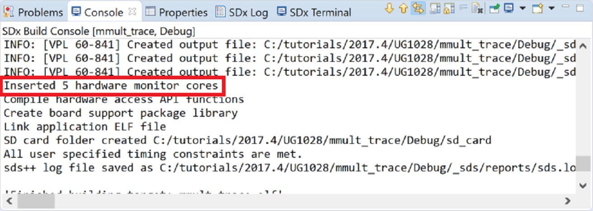
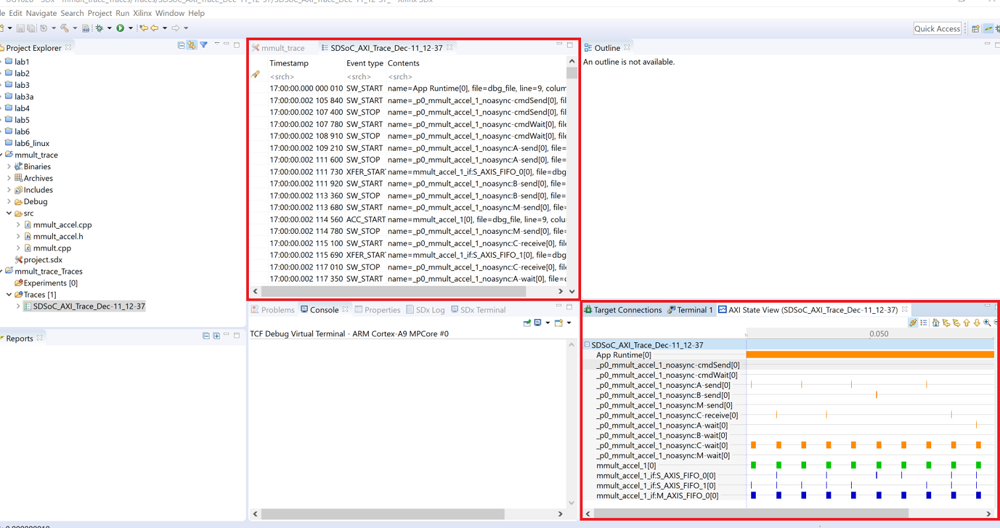
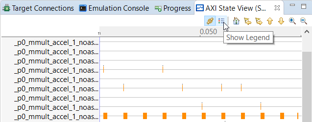
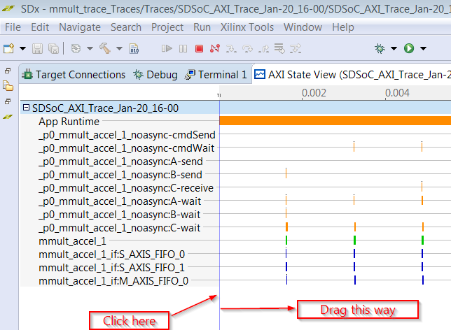
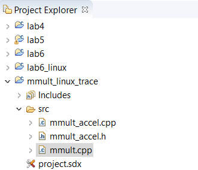
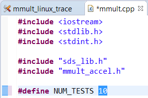
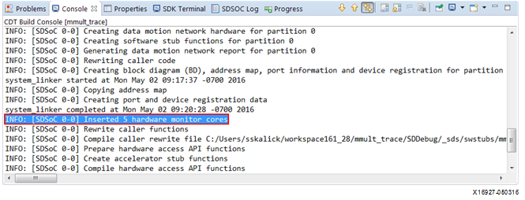
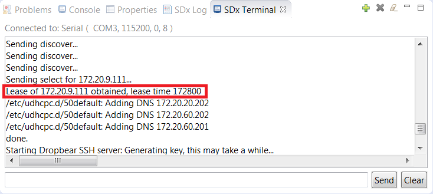

<table style="width:100%">
  <tr>
    <th width="100%" colspan="6"><h1>SDSoC 環境チュートリアル: 概要</h1>
</th>
  </tr>
  <tr>
    <td align="center"><a href="README.md">概要</a></td>
    <td align="center"><a href="lab-1-introduction-to-the-sdsoc-development-environment.md">演習 1: SDSoC 開発環境の概要</a></td>
    <td align="center"><a href="lab-2-performance-estimation.md">演習 2: パフォーマンスの見積もり</a></td>
    <td align="center"><a href="lab-3-optimize-the-application-code.md">演習 3: アプリケーション コードの最適化</a></td>
    <td align="center"><a href="lab-4-optimize-the-accelerator-using-directives.md">演習 4: 指示子を使用したアクセラレータの最適化</a></td>
  </tr>
  <tr>
    <td align="center"><a href="lab-5-task-level-pipelining.md">演習 5: タスク レベルのパイプライン</a></td>
    <td align="center"><a href="lab-6-debug.md">演習 6: デバッグ</a></td>
    <td align="center">演習 7: ハードウェア デバッグ</td>
    <td align="center"><a href="lab-8-emulation.md">演習 8: エミュレーション</a></td>
    <td align="center"><a href="lab-9-installing-applications-from-github.md">演習 9: GitHub からのサンプルのインストール</a></td>
</table>

## 演習 7: ハードウェア デバッグ  

この演習では、プロジェクトを作成し、トレースをオンにし、アプリケーションを実行し、トレース結果を表示して確認する方法を手順を追って説明します。このチュートリアルでは、ホスト PC が直接 Zynq-7000 ボードに接続されており、ボードはザイリンクス ZC702 ボードであると想定しています。このチュートリアルは、ほかのボードおよびコンフィギュレーションにも適用できますが、詳細な手順は少し違う可能性もあります。このチュートリアルでは、既に SDx IDE をインストールして GUI を起動してワークスペースを選択したものと想定して説明します。  
   

>**:pushpin: 注記:**  このチュートリアルは、ZC702 ボードがなくても終了できます。SDx プロジェクトを作成する際に、推奨されている [Matrix Multiplication] テンプレートが見つからない場合は、ボードと使用可能なテンプレートの 1 つを選択してください。たとえば、より小型の Zynq-7000 デバイスを含む MicroZed ボードなどのボードの場合、使用可能なテンプレートに [Matrix Multiplication (area reduced)] アプリケーションがリストされます。このチュートリアルの学習目標は、どのアプリケーションでも達成できるようになっています。  

### スタンドアロンまたはベアメタル プロジェクトのトレース  

新規プロジェクトの作成方法、SDSoC トレース機能を有効にするようにプロジェクトを設定する方法、プロジェクトのビルド方法、ボード上でのアプリケーションの実行方法などを学ぶことができます。  
  

<strong>手順 1: 新規プロジェクトの作成</strong>
  

1. [File] → [New] → [SDx Project] をクリックします。  
2. [Project Type] ページでは、デフォルトで [Application Project] がオンになっています。[Next] をクリックします。   
3. Create a New SDx Project ページで、[Project name] に `mmult_trace` と入力し、[Next] をクリックします。  
4. [Platform] ページで [zc702] を選択し、[Next] をクリックします。  

   >**:pushpin: 注記:**  ZC702 ボード以外を使用している場合は、適切なプラットフォームを選択します。  

5. [System Configuration] に [Standalone OS] を選択します。  
6. [Available Templates] で [Matrix Multiplication Data Size] を選択し、[Finish] をクリックします。  
7. [Project Explorer] ビューで矢印アイコンをクリックしてさまざまなフォルダーを展開表示し、`mmult.cpp` ファイルを開きます。

     

8. テスト シンボル NUM_TESTS の数値を 256 から 10 に変更し、ファイルを保存して閉じます。  

     

9. [SDx Project Settings] ([mmult_trace] タブ) の [Hardware Functions] セクションで mmult_accel がハードウェアにインプリメントされるようマークされていることを確認します。  

     

<strong>手順 2: [Options] セクションでトレース機能をオンにしてプロジェクト設定を変更</strong>
  

[Project Settings] ウィンドウで [Enable event tracing] をオンにします。   

  

<strong>手順 3: プロジェクトのビルド</strong>

[Build] ボタンをクリックし、プロジェクトをビルドします。これには多少時間がかかります。  

Vivado HLS ですべてのハードウェア関数がインプリメントされ、Vivado IP インテグレーター デザインが作成されると、コンソールに `Inserted # hardware monitor cores` というメッセージが表示されます。このメッセージは、デザインでトレース機能がイネーブルになったことと、自動挿入されたハードウェア モニター コアの数を示します。  

  

<strong>手順 4: ボードでのアプリケーションの実行</strong>
  

  1. ビルドが終了したら、[Project Explorer] ビューでプロジェクトを右クリックし、[Run As] → [Trace Application (SDx Application Debugger)] をクリックします。  

     >**:pushpin: 注記:**  [Debug As] をオンにするとブレークポイントが有効になるので、オンにしないようにしてください。プログラムの実行がブレークポイントで停止すると、ソフトウェアは停止しますが、ハードウェアとタイムスタンプに使用されるトレース タイマーは実行し続けるので、タイミングが正確なものになりません。  

     [Trace Application (SDx Application Debugger)] をクリックすると、ボードにビットストリームおよびアプリケーション ELF がダウンロードされ、アプリケーションが開始されて、トレース データの収集が開始されてアプリケーションが終了するまで収集されます。アプリケーションが終了するかトレース データの収集中にエラーが発生すると、収集されたデータが表示されます。  

     >**:pushpin: 注記:**  トレース データが正しく収集されるためには、アプリケーションが正常に終了する必要があります。ハードウェアまたはソフトウェアが停止したり、Linux カーネルがクラッシュするなど、アプリケーションが正常に終了しなかった場合、トレース データが正しく収集されない可能性があります。  

       

  2. アプリケーションが終了すると、すべてのトレース データが収集され、表示されます。イベントのテキスト リスト (下の図で黄色で囲まれたエリア) とイベント タイムライン (下の図で紫色で囲まれたエリア) の 2 つのエリアがあります。これらのエリアは、同じ情報を示します。テキスト リストには、イベントが時間の降順に表示されます。イベント タイムラインは、デザインの各トレース ポイント (トレースされたモニター コアまたはソフトウェアの領域) が複数の軸で表示されます。   

       

     アプリケーションの 10 回の反復が繰り返されたイベント グループとして示されているのがわかります。オレンジのイベントはソフトウェア イベント、緑のイベントはアクセラレータ イベント、青のイベントはデータ転送イベントです。別の色で指定されたトランザクションは、[Show Legend] アイコンをクリックしても確認できます。

       

     次のような [State Transition Visualizer] ダイアログ ボックスが開きます。

       

  3. イベント タイムラインのトレース ポイントの名前に省略記号 (...) が付いている場合、名前が表示されているグレーのエリアとタイムラインが表示されている白のエリアの境界 (適切な位置にカーソルを置くと境界線が赤色に変わる) をクリックして右にドラッグすると、名前のエリアを広げることができます。  

         

  4. イベントのいずれかにカーソルを置くと、ツール ヒントに各トレースの詳細情報が表示されます。次の図に、最初のアクセラレータ イベントを示します。このイベントは、Vivado HLS でハードウェアにインプリメントするよう選択した `mmult_accel` 関数の開始/停止に対応します。開始時間は 0.002122960 秒 (2,122 ns) で、停止時間は 0.003850640 秒 (3,850 ns) です。イベントの期間 (この場合はアクセラレータの実行時間) は 0.001727680 秒 (1,727 ns) です。   

       

<strong>手順 5: Linux プロジェクトのトレース</strong>
  

新規プロジェクトの作成方法、SDx トレース機能を有効にするようにプロジェクトを設定する方法、プロジェクトのビルド方法、ボード上でのアプリケーションの実行方法、トレース データの確認方法などを学ぶことができます。  

  1. 新しいプロジェクトを作成します。  
     1. [File] → [New] → [SDx Project] をクリックします。  
     2. [Project Type] ページでは、デフォルトで [Application Project] がオンになっています。[Next] をクリックします。  
     3. New Project ウィザードで、[Project name] に `mmult_linux_trace` と入力し、[Next] をクリックします。  
     4. ハードウェア プラットフォームに [zc702] を選択します。[Next] をクリックします。  
     5. [System Configuration] に [Linux] を選択します。  
     6. [Next] をクリックします。  
     7. [Available Templates] で [Matrix Multiplication Data Size] を選択し、[Finish] をクリックします。  
     8. [Project Explorer] ビューで矢印アイコンをクリックしてさまざまなフォルダーを展開表示し、src フォルダーの下の `mmult.cpp` ファイルを開きます。  

              

     9. テスト シンボル NUM_TESTS の数値を **256** から 10 に変更し、ファイルを保存して閉じます。  

            

     10. [SDx Project Settings] ([mmult_linux_trace] タブ) の [Hardware Functions] セクションで mmult_accel がハードウェアにインプリメントされるようマークされていることを確認します。  

  2. プロジェクト設定を変更し、SDx IDE でトレース機能をイネーブルにします。  
     [SDx Project Settings] の [Options] セクションの [Enable event tracing] をオンにします。  

  3. プロジェクトをビルドします。  
     [Build] ボタンをクリックし、プロジェクトをビルドします。これには多少時間がかかります。  

     Vivado HLS ですべてのハードウェア関数がインプリメントされ、Vivado IP インテグレーター デザインが作成されると、コンソールに `Inserted # hardware monitor cores` というメッセージが表示されます。このメッセージは、デザインでトレース機能がイネーブルになったことと、自動挿入されたハードウェア モニター コアの数を示します。    

         

       

  4. ボード上でアプリケーションを実行します。  
     1. ビルドが完了したら、sd_card ディレクトリのファイルを SD カードにコピーし、SD カードをボードの SD カード ソケットに挿入します。  
     2. イーサネット ケーブルをボードに接続します (ネットワークに接続するか、PC に直接接続)。  
     3. USB/UART ポートを PC に接続し、[SDx Terminal] タブで + ボタンをクリックしてシリアル コンソールを開きます。  
     4. USB/JTAG ポートを PC に接続し、ボード上で Linux を起動します。  
     5. [SDx Terminal] ログから ZC702 ボードの IP アドレスを確認します。

          

  6. [Linux を使用したパフォーマンス見積もりの使用](lab-2-performance-estimation.md) の方法に従って [Project Explorer] ビューで Linux TCF エージェントを設定します。  

  7. [Project Explorer] ビューでプロジェクトを右クリックし、[Run As] → [Trace Application (SDx Application Debugger)] をクリックします。  

     >**:pushpin: 注記:**  [Debug As] をオンにするとブレークポイントが有効になるので、オンにしないようにしてください。プログラムの実行がブレークポイントで停止すると、ソフトウェアは停止しますが、ハードウェアとタイムスタンプに使用されるトレース タイマーは実行し続けるので、タイミングが正確なものになりません。  

     [Trace Application (SDx Application Debugger)] をクリックすると、イーサネット TCF エージェント接続を介して ELF ファイルがダウンロードされ、アプリケーションが開始して、トレース データの収集が開始されてアプリケーションが終了するまで収集されます。アプリケーションが終了するかトレース データの収集中にエラーが発生すると、収集されたデータが表示されます。  

     >**:pushpin: 注記:**  トレース データが正しく収集されるためには、アプリケーションが正常に終了する必要があります。ハードウェアまたはソフトウェアが停止したり、Linux カーネルがクラッシュするなど、アプリケーションが正常に終了しなかった場合、トレース データが正しく収集されない可能性があります。  

  5. トレース データを確認します。アプリケーションが終了すると、すべてのトレース データが収集され、表示されます。

<strong>手順 6: トレースの表示</strong>

  1. アプリケーションを実行してトレース データを収集すると、トレースのアーカイブが作成され、プロジェクトのビルド ディレクトリ `<build_config>/_sds/trace` に保存されます。  
  2. このトレース アーカイブを開くには、右クリックして [Import and Open AXI Trace] をクリックします。  
     `_sds/trace` フォルダーには、`metadata` および `sdsoc_trace.tcl` も含まれます。これらのファイルはビルド中に生成され、トレース データを抽出し、トレース可視化アーカイブを作成するために使用されます。これらのファイルを削除または変更すると、トレース データを収集できなくなり、クリーンアップおよびビルドを実行して再生成する必要があります。  

Copyright&copy; 2018 Xilinx

この資料は表記のバージョンの英語版を翻訳したもので、内容に相違が生じる場合には原文を優先します。資料によっては英語版の更新に対応していないものがあります。日本語版は参考用としてご使用の上、最新情報につきましては、必ず最新英語版をご参照ください。