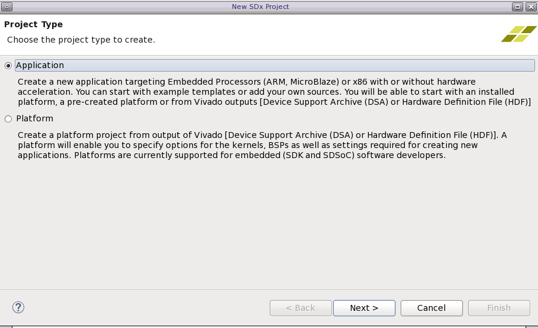
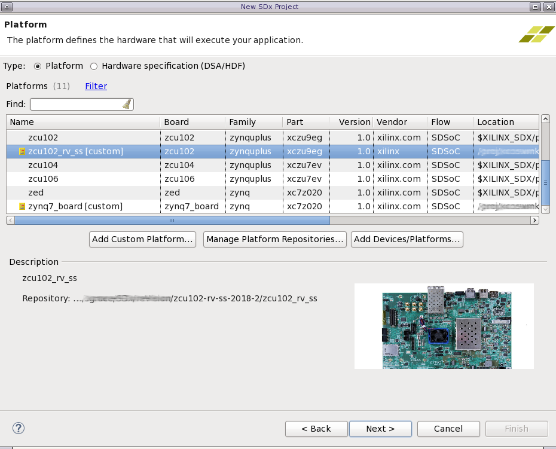
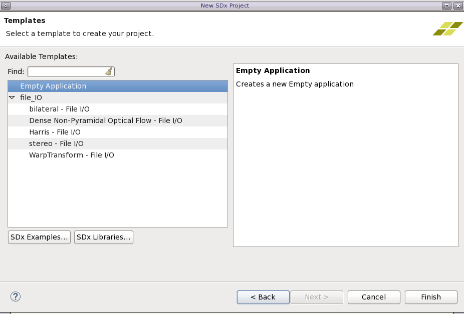
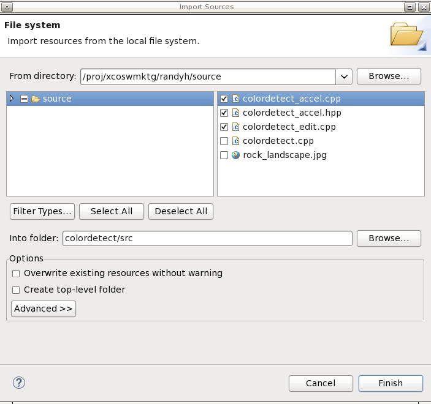
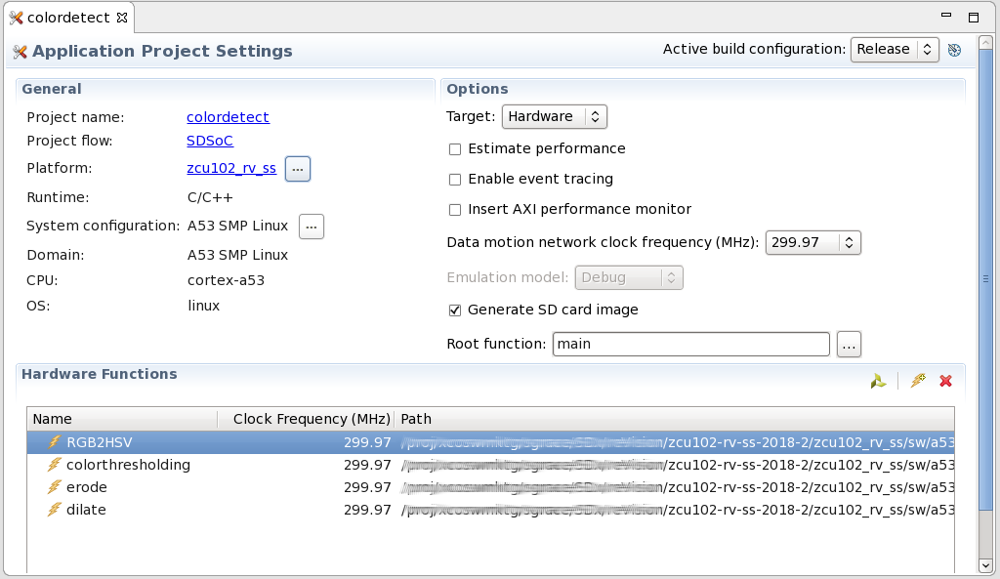

<table style="width:100%">
    <tr>
        <th width="100%" colspan="6"><h1>SDSoC Environment Tutorial: Migrate OpenCV to xfOpenCV</h2>
        </th>
    </tr>
    <tr>
    <td align="center"><a href="README.md">Introduction</a></td>
    <td align="center"><a href="lab-1-migrate-opencv-to-xfopencv.md">Lab 1: Migrate OpenCV to xfOpenCV</a></td>
    <td align="center"><a>Lab 2: Build the SDSoC Acceleration Project</a></td>
    </tr>
</table>


## Lab 2 - Build SDSoC Acceleration Project

This lab is to help you understand how to build an SDSoC application project using that hardware accelerated xfOpenCV functions running on the ZCU102 reVISION platform. It requires you to have 2018.2 SDx installed, and the ZCU102 reVision platform. Refer to this location to download the [reVision platform](https://www.xilinx.com/member/forms/download/design-license-xef.html?akdm=1&filename=zcu102-rv-ss-2018-2.zip).


### Step 1: Create SDSoC Application Project w/ ZCU102 reVISION

1. Open a terminal and source the `settings64.csh`/`settings64.sh` script from within the 2018.2 install area: `/path/to/SDx/2018.2/`

2. In a Linux terminal, set `SYSROOT` to point to the sysroot directory of the ZCU102 reVISION platform. By setting the `SYSROOT` to the appopriate location, the application to be built will have access to compiled includes and libraries specific to the ARM processor, and not the machine SDx is running on.

    For Bash:

	```bash
	export SYSROOT=/<path>/<to>/zcu102-rv-ss-2018-2/petalinux/sdk/sysroots/aarch64-xilinx-linux
	```

	For C-Shell:

	```csh
	setenv SYSROOT /<path>/<to>/zcu102-rv-ss-2018-2/petalinux/sdk/sysroots/aarch64-xilinx-linux
	```

3. Navigate to a directory in which you want add an SDx workspace, and launch SDx IDE using the following command:

	```bash
	sdx -workspace rv_lab
	```
    >**:pushpin: NOTE:**
    >You can use an existing SDx workspace if you prefer. 


4. Create an Application Project.

	

5. Project Name = **colordetect**

	

6. Add the reVISION platform by clicking "Add Custom Platform..." button and navigate to the `zcu102_rv_ss` directory, select it, and click "OK". Then select the platfrom from the list and click "Next." This will add the platfrom to the workspace so that you can use it in other projects going forward.

	

7. In the "System Configuration" window make sure that the "System Configuration" is set to **A53 SMP Linux**, Runtime is set to **C/C++**, the domain is set to **a53_0**, and that it is an **Executable (elf)**. Click "Next".

	

8. In the "Templates" window you can select any example design that is installed with the platform. However, in this case select the **Empty Application** and click "Finish."

	

    The SDx environment creates an SDSoC application project based on the platform you have selected, and the various options you specified. The SDx IDE displays the "Application Project Settings" window. This window is where you can see and set options for the project, specify hardware functions that will be compiled, and what type of build configuration is in use. 

9.  Change the Active build configuration from "Debug" to "Release."
    - Changing from Debug to Release allows for any program to run on the ARM to be optimized.

	

### Step 2: Import the OpenCV code

1. With the project ready, you need to import source code to be used. Right-click on the "src" directory in the Project Explorer and select "Import Sources..." This will bring up the Import Wizard which will allow us to select the source code to use.

2. In the **From directory** navigate to the directory where you saved the colordetect.cpp file and click "OK".

	

3. Select the source file and make sure it is being copied into the "src" directory.

4. Click "Finish" and make sure in the Project Explorer that under the "src" directory the imported source file are there.

### Step 3: Determining and Adding the Hardware Functions

With the addition of the xfOpenCV functions you have hardware optimized functions and objects that can be used in the programmable logic of the ZCU102 board. Now you need to identify these functions as hardware functions to the sds++ compiler.

1. In the Application Project Settings window, look for the section "Hardware Functions." This section is where you will be able to add the functions. Click the button that looks like a lightening bolt. This will bring up a dialog that will analyze the project code and provide suggestions on which function can be accelerated.

	

	As you can see, it has identified the `colordetect`, `colordetect_accel` and `main` functions as candidates for hardware acceleration. You could select the `colordetect_accel` function you created in Lab 1, but due to the use of templating to define that function, this will not work correctly. Instead, you need to select the individual xfOpenCV functions you used in your code.

    Generally, this is the dialog box where you would specify hardware functions. However, since sifting through the whole xfOpenCV library searching for functions is not very efficient, you will use another method to add hardware functions. 

2. Click "Cancel" on the `Add Hardware Functions` dialog box.

3. In the "Project Explorer" expand the "Includes" of the **colordetect** project, and expand the include path of `/<path>/<to>/zcu102_rv_ss/sw/a53_linux/inc/xfopencv`. 
   
4. The xfOpenCV functions are in the "imgproc" folder, so expand that folder.

5. Expand the `xf_rgb2hsv.hpp` file, locate and expand the "xf" namespace. This is where the `RGB2HSV` function lives.

6. Right-click on the function and you will see the option of "Toggle SW/HW". This will let you toggle the function between running on the Arm and being accelerated.

	

6. Repeat the previous steps from the "imgproc" directory and locate the functions: 
    - colorthresholding in the `imgproc/xf_inrange.hpp`
    - erode in `imgproc/xf_erosion.hpp`
    - dilate in `imgproc/xf_dilation.hpp`

	

Now your Hardware Functions should show 4 accelerated functions. Once completed, collapse the "Includes" directory in the "Project Explorer".

### Step 4: Adding Performance Monitoring

Now that you know which functions will be accelerated in the programmable logic, you need to determine what kind of performance you're getting in comparison to the performance of the code running on the Arm processor. In order to capture performance measurements you need to modify your source code. 

1. Open your `colordetect` C++ source code in the SDSoC code editor by double-clicking the `colordetect.cpp` source file in the "Project Explorer" view (or right-click on it and select the "Open" command).

2. Add a new include called the `sds_lib.h`. 

    This header file contains two functions, `sds_clock_counter` and `sds_clock_frequency`, to help with measuring execution time. The `sds_clock_counter` returns the count of the free running clock on the ARM and the return type is an `unsigned long`. The `sds_clock_frequency` will return the operating frequency of the ARM processor. you know this will be 1.2GHz.

    >**:pushpin: NOTE:**
    >The `sds_lib.h` requires that the `stdio.h` header be included before it.

3. To simplify the timing code to be used you will use pre-defined macros for measuring time. Add the following lines to your source code after where you included the `colordetect_accel.hpp` statement:

	```C++
	#include "sds_lib.h"
	unsigned long clock_start, clock_end;
	#define TIME_STAMP_INIT clock_start = sds_clock_counter();
	#define TIME_STAMP  { clock_end = sds_clock_counter(); printf("elapsed time %lu \nelapsed real-time %f ms \n", clock_end-clock_start, (1000.0/sds_clock_frequency())*(double)(clock_end-clock_start)); clock_start = sds_clock_counter();  }
	```

	Looking at the code, you are recording the start time (`clock_start`) and end time (`clock_end`) using `sds_clock_counter`. The `sds_clock_frequency` function helps translate the values of `clock_end` and `clock_start` to wall clock time (milliseconds).

4. To use these macros, you need to add them around both the `colordetect()` and `colordetect_accel()` functions. Add the following to your source code file:

	```c++
	std::cout << "CPU" << std::endl;
	TIME_STAMP_INIT
	colordetect(in_img, out_img, nLowThresh, nHighThresh);
	TIME_STAMP

	std::cout << "Accelerator" << std::endl;
	TIME_STAMP_INIT
	colordetect_accel(xfIn,xfOut,nLowThresh,nHighThresh);
	TIME_STAMP
	```

	You don't need to add the `std::cout`'s for separation, but it is a good idea so you know how long each process ran.

	By measuring the performance of the functions, you can know how long the Arm and hardware accelerator took in processing the same input file.

5. Save your source code file.

### Step 5: Adjusting C/C++ Build Options
Prior to building the project, there are a few remaining reVision libraries that must be referenced to successfully complete the build process. 

1. To adjust these build settings, from the Assistance view, right-click the Release configuration and select the "Settings" command.

2. From the Build Configuration Settings dialog box, click the "Edit Toolchain Settings" link to open the Settings dialog box. 

3. Under both the SDSCC Compiler and SDS++ Compiler settings, select the "Directories" page and click the "Add" command to add the following path: 
   
   `${SYSROOT}/usr/include` to the "Directories" page. 

    

4. Also under both the SDSCC Compiler and SDS++ Compiler settings, select the "Miscellaneous" page and append the following text at the end of the "Other flags" field: 
   
   `-hls-target 1`  

    

    Under the SDS++ Linker options there are two pages that need to be modified: "Libraries" and "Miscellaneous". This will define what OpenCV libraries you are using, and make sure that `SYSROOT` is being linked appropriately.

5. Under SDS++ Linker settings, select "Libraries" and in the "Libraries (-l)" field click the "Add" button to add the following libraries:	
	- opencv_core
	- opencv_imgproc
	- opencv_highgui
	- opencv_imgcodecs
	
	These libraries relate to functions you used in the code.

	


6. Also under SDS++ Linker settings, select "Miscellaneous" and in the "Linker Flags" field add the following: 
	
	`--sysroot=${SYSROOT} -Wl,-rpath-link=${SYSROOT}/lib,-rpath-link=${SYSROOT}/usr/lib`

	This is needed because you need to make sure that you are calling compiled libraries and includes from the reVISION platform. 

7. Close the "Build Configuration Settings" dialog boxes. 

    After all the changes are made, you are ready to build the project. 

8. In the Assistant view, click the "Build" command (hammer icon).

During the build process, the functions marked for hardware will be compiled and processed for the programmable logic, and the process of building a bitstream for the device. This step will take the longest since it is building a bitstream.

### Step 6: Running the code on the platform

Once the build is complete, you need to program the board to run the application you just built.

1. Navigate to the `sd_card` directory and copy the contents of this directory to the SD Card of the board. The files listed are:
	- BOOT.BIN
	- colordetect.elf
	- image.ub
2. Copy the supplied image file (`rock_landscape.jpg`) to the SD card. 

    Once completed, your SD Card should be filled with the following files:
	- BOOT.BIN
	- colordetect.elf
	- image.ub
	- rock_landscape.jpg
3. Eject the SD Card from your machine and insert into the ZCU102 board.

    Next you need to setup serial communications to the board. Make sure you have the right driver and a program like Teraterm or PuTTy installed on your machine.

3. In your serial communciation program, make sure your communication speed is set to 115200 and that it is an 8-n-1 format.
	- On Windows, make sure you are using a COM port associated with the "Interface 0" of the Silicon Labs Quad CP2108 USB to UART Bridge.

5. Turn on the ZCU102 platform board and the terminal you're using should start displaying boot information for Linux.

	- If no data is coming from the UART, check the LEDs on the board. If any LED is red, then the boot will have failed. It is best to double check the SD Card contents and try it again.

7. When a command prompt shows up, navigate to the SD Card mount point: `cd media/sd_card`.

	- If the command fails, run the command `mount` and locate the SD Card mount (it may be `mmblk0`)

8. In the mount point, run an `ls` command to make sure all the files are there. If any files are missing (like the input image) type: `halt` on the prompt and wait for the system to shutdown. Move the SD Card back to the machine and copy the missing files and restart the process again.

	>**:pushpin: NOTE:**
    >The board won't turn off, wait for the filesystem to unload and then power the board off.

9. To run the application run the command: `./colordetect.elf rock_landscape.jpg`

    The performance differnces between running on the Arm versus running accelerated on the programmable logic should be significant. You should see similar results to this:

    ```bash
    $ ./colordetect.elf rock_landscape.jpg
    CPU
    elapsed time 298321668
    elapsed real-time 248.626252 ms
    Accelerator
    elapsed time 12168372
    elapsed real-time 10.141324 ms
    ```

    >**:pushpin: NOTE:**
    >You can run the command as many times as you want to log more than one point of elapsed time.

1. Once the command prompt shows up the application has completed and you can stop the system. To stop it properly, you will need to type `halt` in the prompt. This will begin the shutdown procedure to make sure that the file system does not get corrupted.
   
2. After a few moments you should try to enter some random text or hit `enter` a few times in the terminal program and if nothing changes, go ahead and turn the board off.
   
3. Once off, pull out the SD Card and plug it into your computer so you can view the image results. The files you should see are:
	- input.png – The original image in PNG format
	- output.png – The CPU result of the color detection
	- accel_out.png – The Accelerated result of the color detection

The image results should appear as follows:

| CPU                           | Accelerated                        |
| :---------------------------: | :--------------------------------: |
|  |  |

As you can see in comparison, the programmable logic shows around a 24x improvement in run time over the code that ran on the Arm. Another thing to notice is that the CPU version may show slightly more detail, but the Accelerated version is very close in comparison. This shows that you can get very good quality results of outputs in faster runtime.

### Conclusion

In summary, you have taken an OpenCV program and converted it to a hardware accelerated program using xfOpenCV, and run it on the ZCU102 to compare results. You have learned to:

- Identify and modify OpenCV code to utilize the optimized xfOpenCV
- Call templatized xfOpenCV functions
- Update build settings for a program to run on the reVISION Platform

Now that you have completed this tutorial, you can modify the threshold values to try and get different outputs, or begin migrating your own OpenCV to the reVISION Platform.

<hr/>

:arrow_backward:**Previous Topic:**  [Lab 1 - Migrate OpenCV to xfOpenCV](lab-1-migrate-opencv-to-xfopencv.md)


---
<p align="center"><sup>Copyright&copy; 2018 Xilinx</sup></p>
