<table style="width:100%">
  <tr>

<th width="100%" colspan="6"><h1>SDSoC Platform Creation Labs</h2>
</th>

  </tr>
  <tr>
    <td width="17%" align="center"><a href="README.md">Introduction</a></td>
    <td width="16%" align="center">Lab1: Creating the DSA for a Zynq-7000 SoC Processor Design</td>
    <td width="17%" align="center"><a href="Lab2-Creating-Software-Components.md">Lab 2: Creating Software Components for the Platform</a></td>
    <td width="17%" align="center"><a href="Lab3-Creating-Custom-Platform-Using-the-SDx-IDE.md">Lab 3: Creating a Custom Platform Using the SDx IDE</a></td>
  </tr>
</table>

## Lab1: Creating the DSA for a Zynq-7000 SoC Processor Design  

In this lab you will use the Vivado&reg; Design Suite to create a Zynq&reg;-7000 SoC processor design that uses the Arm&reg; Cortex&trade;-A9 processing system (PS) as well as IP blocks in the programmable logic (PL) region. The Clocking Wizard IP is used to generate several clocks for potential use in the final design. Multiple Processor System Reset IP blocks will be added to synchronize resets of the various clock sources. A pathway into the PS block for interrupts generated by PL IP blocks will also be included. Select hardware interfaces will be declared for use by the sds++ system compiler for attaching hardware accelerators. The hardware design and its interface meta-data will then be encapsulated in a Device Support Archive (DSA) file for later use in creating a custom SDSoC platform (see <a href="Lab3-Creating-Custom-Platform-Using-the-SDx-IDE.md">Lab 3: Creating a Custom Platform Using the SDx IDE</a>).

If you are not familiar with the Vivado Design Suite IDE, see the *Vivado Design Suite User Guide: Getting Started* ([UG910](https://www.xilinx.com/support/documentation/sw_manuals/xilinx2018_2/ug910-vivado-getting-started.pdf)).

<details>
<summary><big><strong>Step 1: Start the Vivado IDE and Create a Project</strong></big></summary>

#### On a Linux host machine:

At the shell prompt, type the following commands:
   
   1. `source <Xilinx_Install_Directory>/SDx/<Version>/settings64.{sh,csh}`
   2. `vivado`
    
The first command sets the environment variables prior to launching Vivado and the second command launches the Vivado IDE. 

#### On a Windows host machine:

For a Windows host machine, use one of the following methods to launch Vivado:

   - Click the Vivado desktop icon.

   - From the Start menu, select Xilinx Design Tools \> Vivado 2018.2 \> Vivado 2018.2.

   - From a Command prompt window, type the following commands:
   
      1. `<Xilinx_Install_Directory>/SDx/<Version>/settings64.bat`
      2. `vivado`
    
     The first command sets the environment variables prior to launching Vivado and the second command launches the Vivado IDE. 

#### Creating a Vivado project

Follow these steps to create a Vivado project:

1. From the **Quick Start** section, click **Create Project**, as shown in the following figure.

    

2. The New Project Wizard opens. Click **Next**.

    
    
   The **Project Name** dialog box opens.

3. Enter **zynq7_board** in the Project name text box.

4. Enter **/tmp** in the Project Location text box.

5. Select the **Create project subdirectory** check box.

   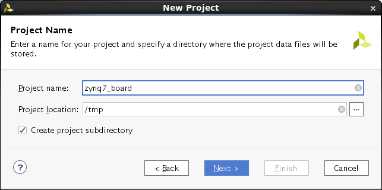

6. Click **Next**. The **Project Type** dialog box appears.

7. Select **RTL Project**.

    

8. Click **Next**. The **Add Sources** dialog box appears.

7. Select **Verilog** from the Target language dropdown list.
8. Select **Mixed** from the Simulator language dropdown list.

    

9. Click **Next**. The **Add Constraints** dialog box appears.

    

10. Click **Next**. The **Default Part** dialog box appears.

11. Select **ZYNQ-7 ZC702 Evaluation Board** from the available boards list.

    >**:information_source: TIP**
    >You can use the Search feature to filter for ZC702.
    
     

12. Click **Next**.

    >**:warning: WARNING**
    > Multiple versions of boards are supported in Vivado. Ensure that you are targeting the design to the right hardware.

13. Review the project summary on the **New Project Summary** page, and then click **Finish** to create the project.

    

</details>

<details>
<summary><big><strong>Step 2: Create an IP Integrator Design</strong></big></summary>

1. In the **Flow Navigator** view, expand **IP INTEGRATOR** and select **Create Block Design**.
   The **Create Block Design** dialog box appears.

   

2. Specify a name for your IP subsystem design. For this example, use **zynq7_board**.

   >:pushpin: **NOTE:**
   >Do not change the default values in the **Directory** and the **Specify source set** dropdown lists.

    

    >**:information_source: TIP**
    > If the Vivado project contains multiple block designs, the IP integrator block design containing the SDSoC platform design must have the same name as the SDSoC platform. Otherwise, you need not name the IP integrator block design the same as the Vivado project or the SDSoC platform.

3.  Click **OK**.

#### Adding IP to the Block Design

You will now add several IP blocks to the IP integrator design. The following table list of the added IP blocks and a summary of their usage in an SDSoC platform:
<table width="100%">
<tr>
<th>IP Block</th><th>Usage Summary</th>
</tr>
<tr>
<td>Zynq-7000 SoC Processor System (PS)</td>
<td>

- Dual-core Arm processor with cache hierarchy

- Integrated I/O peripherals

- DDR memory controller with external memory interface

- PS to Programmable Logic (PL) interconnects

- PL to PS interconnects
</td>
</tr>
<tr>
<td>
Processor System Reset Block (PL)
</td>
<td>

- Reset sequencing and synchronization block for PL logic

</td>
</tr>
<tr>
<td>
Clocking Wizard (PL)
</td>
<td>

- Multiple output clock generator to drive PL logic
</td>
</tr>
<tr>
<td>
Concat Block (PL)
</td>
<td>

- PL interrupt structure that feeds Zynq-7000 SoC PS interrupt request input
</td>
</tr>
</table>
<!-- end list -->

1. On the block design canvas, right-click and select **Add IP**.

    Alternatively, you can click the Add IP button (**+**) on the IP integrator canvas.

    

2. The IP catalog **Search** dialog box appears. In the Search field, type **zynq** to find the ZYNQ7 Processing System IP.

   

3. Select the **ZYNQ7 Processing System** and press the <kbd>Enter</kbd> key to add the IP to your design.

   You can also double-click the IP block to add it to the IP integrator canvas.

   

   The ZYNQ7 Processing System is added to the IP integrator canvas and the Tcl Console window also shows the command used to add the IP.

   `create_bd_cell -type ip -vlnv xilinx.com:ip:processing_system7:5.5 processing_system7_0`

   >**:pushpin: NOTE**
   >There is a corresponding Tcl command for most actions performed in the 
   block design. Tcl commands are documented in the *Vivado Design Suite: Tcl Command Reference Guide* ([UG835]( https://www.xilinx.com/support/documentation/sw_manuals/xilinx2018_2/ug835-vivado-tcl-commands.pdf)).


4.  In the IP integrator window, click the **Run Block Automation** link.

    

    The **Run Block Automation** dialog box opens, as shown below. This dialog box states that the FIXED_IO and DDR interfaces will be created for the Zynq-7000 SoC IP core. The default check in the **Apply Board Preset** field allows the tool to configure the PS to take advantage of the predefined board.

   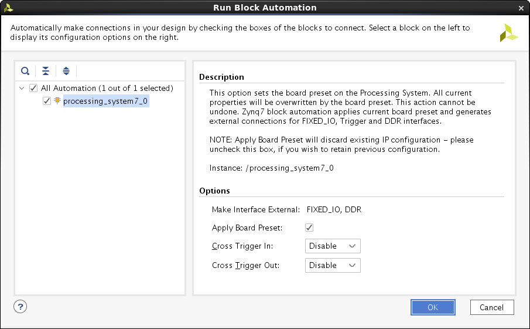

5.  Click **OK** to accept the default settings for the ZC702 board.

    The IP integrator diagram is updated after running block automation on the Zynq-7000 SoC processor.

    

6.  Right-click the IP integrator diagram and select **Add IP** to add peripherals to the PL.

7.  In the **Search** field, type **proc sys res** to find the Processor System Reset, and then press <kbd>Enter</kbd> to add it to the design.
    A synchronized reset signal for each declared platform clock is created using a Processor System Reset IP block. Each reset will be associated with a clock generated by the Clocking Wizard.

    

8.  Repeat the previous two steps to add three more instances of the Processor System Reset IP, for a total of four reset IP blocks. An alternative method is to copy and paste the Processor System Reset block multiple times.

9.  Add a **Clocking Wizard** IP block to provide PL clock(s) for the platform. You will customize the clock settings in a subsequent step.

    

10. Add the **Concat** IP to connect PL generated interrupts to the PS block.

    

    Your block design window should look similar to the figure below. The relative positions of the IP might vary.

    >**:information_source: TIP**
    >You can zoom in and out of the IP integrator diagram using the Zoom In and Zoom Out buttons or their equivalent keyboard shortcuts (**Ctrl**+**Equals** and **Ctrl**+**Minus**, respectively).

    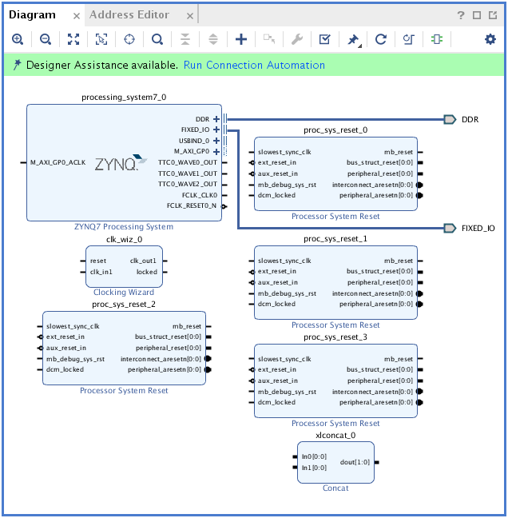

#### Re-Customizing IP

1.  Double-click the ZYNQ7 Processing System IP block to open its customization wizard.

    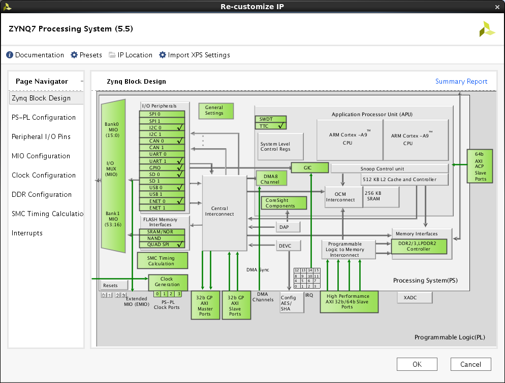

2.  In the Re-customize IP dialog box, change the default processor block settings as indicated below:

    1.  Select **PS-PL Configuration** in the Page Navigator.

    2.  Expand the **AXI Non Secure Enablement** menu.

    3.  Expand the **GP Master AXI Interface** menu.

    4.  Uncheck the **M AXI GP0 interface** check box.

        
        
    This makes both M_AXI_GP0 and M_AXI_GP1 PS interfaces available as hardware accelerator attachment points for the sds++ system compiler. The default PS settings indicate that the M_AXI_GP0 interface is reserved for use by the PS, so by un-checking this selection you are freeing up this interface for use by the SDx tools.     

3.  In the Page Navigator, do the following, as shown in the figure below. 

    1.  Select **Interrupts**

    2.  Add checkmark to the **Fabric Interrupts** check box by clicking on it

    3.  Expand the **Fabric Interrupts** menu

    4.  Expand the **PL-PS Interrupts Ports** menu
    
    5.  Select the **IRQ_F2P[15:0]** check box

        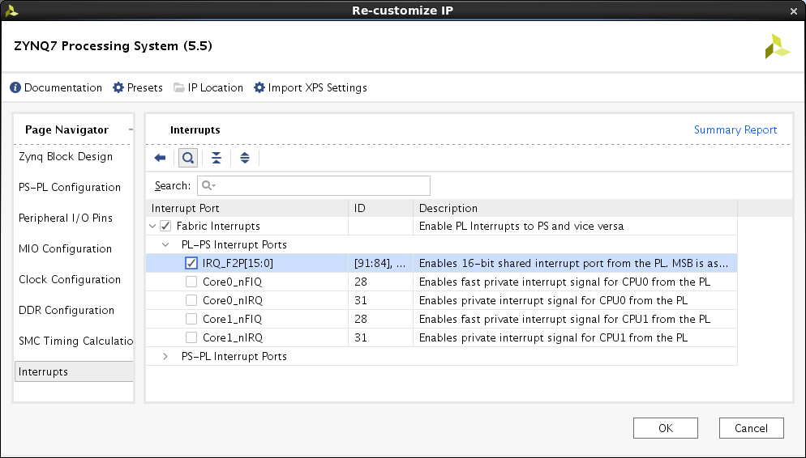
    
        This allows up to 16 PL interrupts to be handled by the PS interrupt input port. Adding the checkmark enables the PS-PL interrupt interface and is used by one side of the PL Concat IP block. The other side of the Concat IP block is declared as available for the sds++ system compiler to route PL interrupts into the PS as needed.

    6.  Click **OK**.

4.  Re-customize the Clocking Wizard by double-clicking on its IP block.

5.  In the **Clocking Options** tab of the Re-customize IP dialog box, click the **Input Frequency** check box for the **Primary Input Clock** and change the value in the adjacent box to **50.000**. There will be a 50 MHz clock generated by the PS and provided as input to the Clocking Wizard IP.

7.  Click the **Output Clocks** tab and add the **clk_out2**, **clk_out3**, and **clk_out4** output clocks by clicking on their respective check-boxes. Set the output frequencies under the **Output Freq (MHz) Requested** column as shown below.

    - clk_out1 -\> 100.000

    - clk_out2 -\> 142.000

    - clk_out3 -\> 166.000

    - clk_out4 -\> 200.000

    Providing a variety of clock frequencies in the PL region adds design flexibility to the base platform. An SDx hardware accelerator can change input clock sources without having to re-define and re-build the base platform if multiple clock sources are available in the platform.

8.  With the **Output Clocks** tab still selected, scroll down to the bottom of the page, and set the **Reset Type** to **Active Low**, as shown in the following figure.

    

9.  Click **OK** to close the Re-Customize IP dialog box for the **Clocking Wizard**.

10. Double-click the **Concat** IP block to open its Re-Customize IP dialog box. PL interrupts will be routed into the PS by the sds++ system compiler through the Concat IP block.

11. Change the **Number of Ports** field to 1, as shown in the following figure.

    This allows the sds++ system compiler a maximum number of PL interrupts for routing into the PS block through the Concat IP since none are being reserved for other uses.

    

13. Click **OK** to close the Re-Customize IP dialog box for the **Concat IP**.

    The IP integrator block diagram should look like the following figure.

    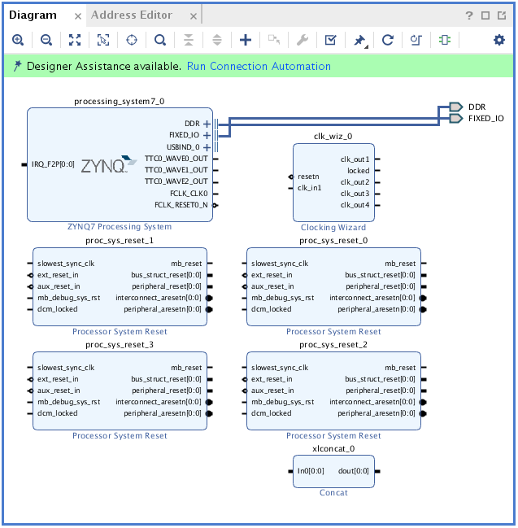

#### Using Designer Assistance

Designer Assistance helps connect the Clocking Wizard and Processor System Reset blocks to the Zynq-7000 SoC processing system.

1.  Click **Run Connection Automation**. The **Run Connection Automation** dialog box appears.

    

2.  Select the clock options for the IP as shown in the following dialog box. As you select each interface on which connection automation is run, the Description and Options available for the selected interface are shown on the right-hand side of the dialog box.

    

3.  Ensure that the automation options are set as in the table below.

    <table>
    <thead>
    <tr class="header">
    <th><strong>Connection</strong></th>
    <th><strong>Description</strong></th>
    <th><strong>Setting</strong></th>
    </tr>
    </thead>
    <tbody>
    <tr class="odd">
    <td><strong>clk_wiz_0</strong><br />
    - clk_in1</td>
    <td>The input clock to the clocking wizard</td>
    <td><em><strong>/processing_system7_0/FCLK_CLK0 (50 MHz</strong></em>) is selected by default as the Clock Source option. Leave set to the default value.</td>
    </tr>
    <tr class="even">
    <td><strong>proc_sys_reset_0<br />
    </strong>- slowest_sync_clk</td>
    <td>Clock source to which this reset is synchronized</td>
    <td>Select <strong>/clk_wiz_0/clk_out1 (100 MHz)</strong> from the Clock Source options drop-down menu.</td>
    </tr>
    <tr class="odd">
    <td><strong>proc_sys_reset_1<br />
    </strong>- slowest_sync_clk</td>
    <td>Clock source to which this reset is synchronized</td>
    <td>Select <strong>/clk_wiz_0/clk_out2 (142 MHz)</strong> from Clock Source options drop-down menu.</td>
    </tr>
    <tr class="even">
    <td><strong>proc_sys_reset_2<br />
    </strong>- slowest_sync_clk</td>
    <td>Clock source to which this reset is synchronized</td>
    <td>Select <strong>/clk_wiz_0/clk_out3 (166 MHz)</strong> from the Clock Source options drop-down menu.</td>
    </tr>
    <tr class="odd">
    <td><strong>proc_sys_reset_3<br />
    </strong>- slowest_sync_clk</td>
    <td>Clock source to which this reset is synchronized</td>
    <td>Select <strong>/clk_wiz_0/clk_out4 (200 MHz)</strong> from the Clock Source options drop-down menu.</td>
    </tr>
    </tbody>
    </table>

4.  Click **OK** to save the settings and close the **Run Connection Automation** dialog box.

#### Making Manual Connections to Connect the Rest of the Design

You will complete the design by manually wiring connections that could have multiple design dependent sources. In this example platform, you use a reset output generated by the PS block to control the reset inputs of logic on the PL-side. Specifically, the Processor System Reset IP block and the Clocking wizard’s clock sources are connected in this manner. You also keep the PL Processor System Reset blocks in their reset state until the clock sources have locked to their requested frequencies. Additionally, any PL generated interrupts are wired to the interrupt request inputs of the PS block.

1.  Connect the **FCLK_RESET0_N** output pin of the ZYNQ7 Processing System IP to the **resetn** input pin of the Clocking Wizard.

2.  Connect the **FCLK_RESET0_N** output pin of the ZYNQ7 Processing System IP to the **ext_reset_in** pin on each of the Processor System Reset IP blocks (proc_sys_reset_0, proc_sys_reset_1, proc_sys_reset_2, and proc_sys_reset_3).

3.  Connect the **locked** output pin of the Clocking Wizard IP to the **dcm_locked** input pin on each of the Processor System Reset IP blocks (proc_sys_reset_0, proc_sys_reset_1, proc_sys_reset_2, and proc_sys_reset_3).

4.  Connect the **dout[0:0]** output pin of the Concat block to the **IRQ_F2P[0:0]** input pin of the ZYNQ7 Processing System IP block.

5.  Click the **Regenerate Layout** button to re-draw the block design with a more optimal layout.

6.  At this point, the block diagram should look similar to the view in the figure below.

    

7.  Click the **Validate** button to validate the design.

    

8.  Click **OK** in the Validate Design dialog box.

9.  Save the block design by clicking on the floppy disk icon in the toolbar or by pressing the **Ctrl**+**S** keys.

</details>

<details>
<summary><big><strong>Step 3: Declaring the Platform Hardware Interfaces</strong></big></summary>

After you complete the IP integrator hardware platform design, you must declare the hardware interfaces that will be available as attachment points for SDSoC accelerators and the data movers that will communicate with them. These declarations are added to the design by setting platform (PFM) properties that define the platform name and indicate which specific clocks, interrupts, and bus interfaces are available for the sds++ system compiler to use in creating a system that has been enhanced with hardware acceleration. These properties are stored in the project.

As the PFM properties persist within the block design (BD), if you start from an existing platform and then make changes there may be properties set that were not intended for the derived platform and can lead to invalid hardware platforms. In such cases, unset any conflicting PFM properties.

In this lab, we use the Platform Interfaces window to declare the hardware interfaces.  These PFM properties will be added to the block design.  You can also use the Vivado Block Properties tab or the TCL console to set the PFM properties that declare the hardware interfaces.  At the end of this section we will provide the TCL commands that can be used to accomplish the equivalent results.

Our block design contains four different clocks generated through the Clocking Wizard. While only one of the clocks is enabled in this lab, the others are available for use with the SDx IDE. Through the SDx IDE you will be able to select which functions to accelerate in hardware and the clock sources for the hardware accelerators. Likewise, you will declare the AXI ports that will be available for moving data to and from the hardware functions. Although, these AXI ports may or may not be directly visible on the block design their PFM property settings make them available for use in the SDx environment.

#### Enabling the Platform Interfaces Tab

1.  On the Vivado main menu select **Window -\> Platform Interfaces**.

2.  Click the **Enable platform interfaces** link to enable the Platform Interfaces tab.

    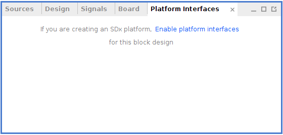

    The Platform Interfaces tab shows all the interfaces available in the block design that can be enabled/disabled for use by the SDx environment in creating hardware accelerators. Right-clicking on an interface or a group of selected interfaces and then selecting Enable, changes the greyed-out icon in front of the interface name to a solid colored icon. An enabled interface means it is available for use by the SDx tools.

    

#### Platform Name
Enabling the Platform Interfaces tab automatically sets the platform name property on the block design. The Vendor, Library, Name, and Version of the platform can be edited from the properties tab of the block design in the Source File Properties window through the **PFM_NAME** property. Clicking on the pencil icon at the right-hand edge of the property text box allows you to edit the property. For the purpose of this tutorial, use the defaults that have already been set.

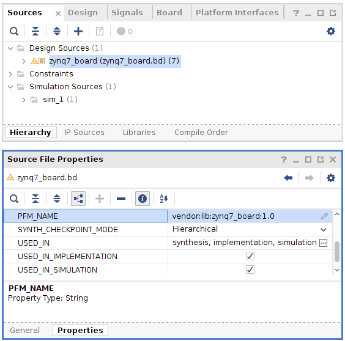

#### Platform Clocks

The four output clocks generated by the Clocking Wizard are declared as available for the sds++ system compiler to use when each of the **clk_wiz_0** clocks (**clk_out1**, **clk_out2**, **clk_out3**, **clk_out4**) are enabled in the Platform Interfaces tab as shown in the figure below. The Platform Interface Properties window shows that **clk_out1** has been selected as the default accelerator clock, since its **is_default** property is check marked. Each declared clock must have an associated synchronized reset signal using the Processor System Reset IP block. The **proc_sys_reset** property in the Platform Interface Properties dialog box is used to make this association for each declared clock. Providing multiple platform clock frequencies allows you to select an accelerator clock source that has a high-probability of being routed and meeting timing constraints when the Vivado implementation tools are invoked. If a particular clock frequency selection does not meet timing, selecting a lower frequency clock source may remedy the issue.

   >**:pushpin: NOTE**
   >To select a range, click a line, then hold the <kbd>Shift</kbd> key down and click on another line to select the lines in between.


1. Right-click on each **clk_wiz_0** clock and select **Enable**.

2. Enable: **clk_out1**, **clk_out2**, **clk_out3**, **clk_out4**.

4.  Select **clk_out1** in the Platform Interfaces tab.

5.  Click the clk_out1 **is_default** option box in the Platform Interfaces Properties, Options tab to add a checkmark.

    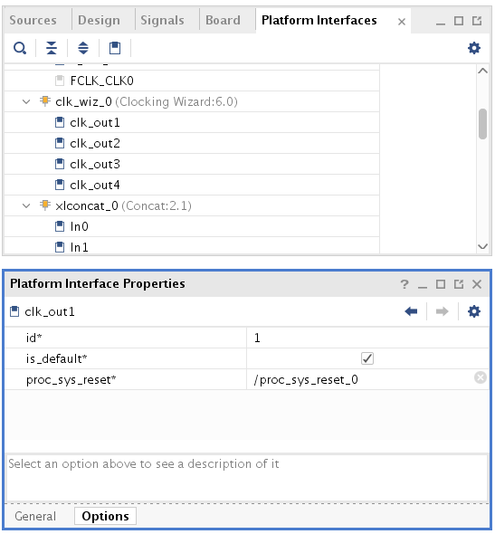

#### Platform AXI Ports

In this custom platform, all the Zynq-7000 SoC PS-side master and slave AXI ports are declared as available for the sds++ system compiler to use, as shown by the enabled **processing_system7_0** interfaces below. The FCLK_CLK0 interface is not enabled for SDx accelerator use, since it is already in use by the hardware design to provide the 50.000 MHz input clock to the Clocking Wizard IP.

Right-click on each **processing_system_7_0** interface, except FCLK_CLK0 - **M_AXI_GP0**, **M_AXI_GP1**, **S_AXI_ACP**, **S_AXI_HP0**, **S_AXI_HP1**, **S_AXI_HP2**, **S_AXI_HP3** , and select **Enable**.


#### Platform Interrupts

Interrupt sources from the PL logic must be connected through the **Concat** IP block to the Zynq-7000 SoC interrupt request input port. The figure below shows that 16 interrupt sources are enabled for the sds++ system compiler to use.

Right-click on **xlconcat_0** inputs **In0** to **In15** and select **Enable**.


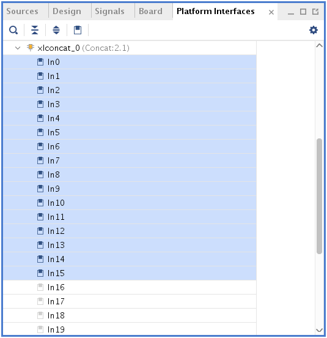

The properties set through the Platform Interfaces tab can be observed by selecting a Platform Interface (processesing_system_7_0, clk_wiz_0, xlconcat_0) and viewing the PFM property within the Block Properties dialog box. The xlconcat_0 PFM properties are shown in the figure below.

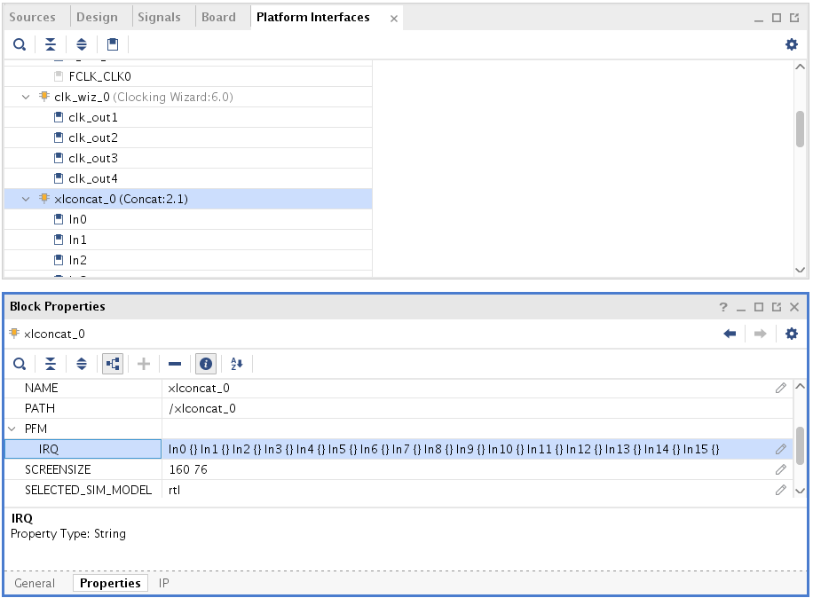

#### Tcl Console Commands (For Reference)

These commands are provided for reference and do not need to be executed if the platform properties are set through enabling and disabling selections in the **Platform Interfaces** tab, as presented in the preceding section. The Vivado journal or log files can be examined to view a history of the Tcl commands issued by actions performed in the **Platform Interfaces** tab.

1.  PFM NAME
    ```
    set_property PFM_NAME “vendor:lib:zynq7_board:1.0”\  
    [get_files [get_property FILE_NAME [get_bd_designs]]]
    ```
2.  PFM CLOCK
    ```
        set_property PFM.CLOCK {\  
        clk_out1 {id “1” is_default “true”\  
        proc_sys_reset “proc_sys_reset_0”}\  
        clk_out2 {id “2” is_default “false”\ 
        proc_sys_reset “proc_sys_reset_1”}\  
        clk_out3 {id “3” is_default “false”\  
        proc_sys_reset “proc_sys_reset_2”}\  
        clk_out4 {id “4” is_default “false”\  
        proc_sys_reset “proc_sys_reset_3”}\  
        } [get_bd_cells /clk_wiz_0]
    ```
3.  PFM AXI Ports
    ```
        set_property PFM.AXI_PORT {\  
        M_AXI_GP0 {memport “M_AXI_GP” sptag “” memory “”}\  
        M_AXI_GP1 {memport “M_AXI_GP” sptag “” memory “”}\ 
        S_AXI_ACP {memport “S_AXI_ACP” sptag “” memory “”}\  
        S_AXI_HP0 {memport “S_AXI_HP” sptag “” memory “”}\  
        S_AXI_HP1 {memport “S_AXI_HP” sptag “” memory “”}\  
        S_AXI_HP2 {memport “S_AXI_HP” sptag “” memory “”}\  
        S_AXI_HP3 {memport “S_AXI_HP” sptag “” memory “”}\  
        } [get_bd_cells /processing_system7_0]
    ```
4.  PFM Interrupts
    ```
        set_property PFM.IRQ {\  
        In0 {} In1 {} In2 {} In3 {} In4 {} In5 {} In6 {} In7 {}\  
        In8 {} In9 {} In10 {} In11 {} In12 {} In13 {} In14 {} In15 {}\ 
        } [get_bd_cells /xlconcat_0]
    ```
</details>

<details>
<summary><big><strong>Step 4: Generating HDL Design Files</strong></big></summary>

You can now generate the HDL files for the design.

1. In the Sources window, right-click the **zynq7_board.bd** block design and select **Generate Output Products**.

    

2. Click **Generate**.

    

3. Observe zynq7_board output generation completed as indicated by the check mark in the Design Runs window.

    

4. Right-click on **zynq7_board.bd** in Sources window and click on **Create HDL Wrapper**  to create a top-level HDL wrapper for the IP integrator block design.

   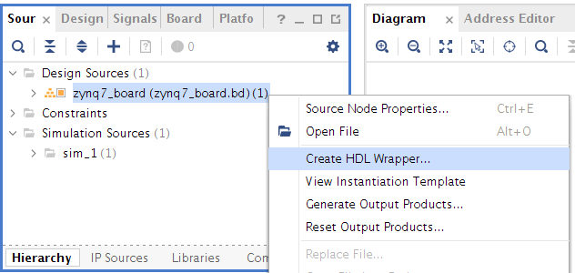

5. Click **OK**.

    

6. In the Flow Navigator, click **Generate Bitstream**.

7. Click **File > Export > Export Hardware**.

8. Select the **Include Bitstream** checkbox.


> You now have a Zynq-7000 SoC bitstream that includes a hardware design without any SDSoC accelerators. This bitstream can be used as a check of hardware functionality before running the design through the SDx IDE to generate hardware accelerators.
</details>

<details>
<summary><big><strong>Step 5: Writing Out the DSA</strong></big></summary>

At this point, you can encapsulate the IP integrator hardware design along with the PFM properties design meta-data into the Device Support Archive (DSA) that becomes part of the SDSoC platform definition.

1.  In the Tcl Console, type the following command and press the <kbd>Enter</kbd> key.

    `write_dsa -force -include_bit /<project dir>/<project name>/<project name>.dsa`

2.  Validate the DSA by entering the following command in the Tcl console.

    `validate_dsa /<project dir>/<project name>/<project name>.dsa`

    

3.  Close the Vivado GUI after validating DSA.

</details>

### Conclusion

In completing Lab 1, you have used the Vivado Design Suite to create a Zynq-7000 SoC hardware design using Vivado IP integrator to target a ZC702 board. In addition to the PS Zynq7 Processor System IP, you added key PL IP blocks for clocks, resets, and interrupts to define a base hardware design. After declaring select hardware interfaces for use by the sds++ system compiler, you created the DSA to define the hardware component of an SDSoC platform.

<hr/>
<p align="center"><sup>Copyright&copy; 2018 Xilinx</sup></p>
