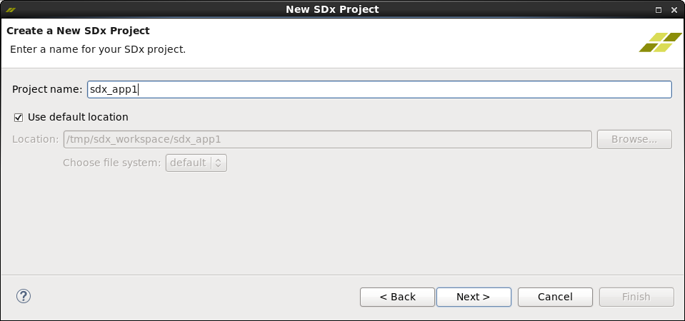
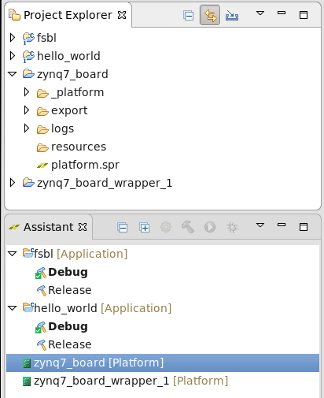
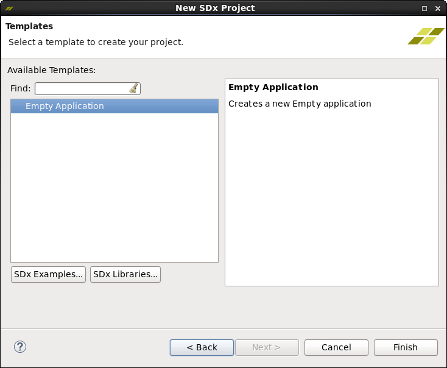
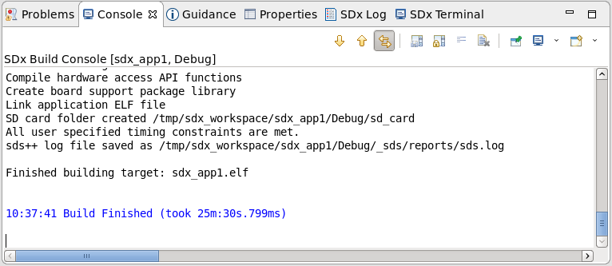
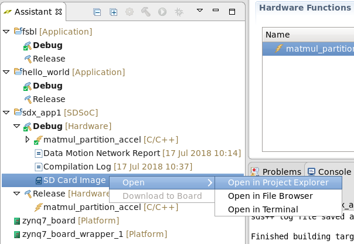



<a>English</a> | <a href="/docs-jp/README.md">日本語</a>

<table style="width:100%">
  <tr>
<td align="center" width="100%" colspan="6"><h1>2018.3 SDSoC™ Development Environment Tutorials</h1>
<a href="https://github.com/Xilinx/SDSoC-Tutorials/branches/all">See other versions</a>
</td>

  </tr>
  <tr>
    <td colspan="4" align="center"><h2>Platform Creation Labs</h2></td>
  </tr>
  <tr>
     <td align="center"><a href="Lab1-Creating-DSA-for-Zynq-MPSoC-Processor-Design.md">Introduction</a></td>
     <td align="center"><a href="Lab1-Creating-DSA-for-Zynq-MPSoC-Processor-Design.md">Lab1: Creating the DSA for a Zynq UltraScale+ MPSoC Processor Design</a></td>
     <td align="center"><a href="Lab2-Creating-Software-Components.md">Lab 2: Creating the SDSoC Platform</a></td>
     <td align="center">Lab 3: Using Your Custom Platform</td>
   </tr>
</table>

## Lab 3: Using Your Custom Platform

1.  On the SDx IDE menu, select **File \> New \> SDx Application Project** to begin creating a new Application project.

2.  In the Create a New SDx Application Project dialog, type **sdx\_app1** as the Project name.

3.  Click **Next**.

    

4.  In the Platform dialog, select **Add Custom Platform** command (the '+' icon).

    This opens the Specify Custom Platform Location dialog box, letting you navigate to the platform folder. If you were following the instructions in this tutorial, you will find the platform at /tmp/sdx_workspace/zcu102_board/export/zcu102_board.

    

5. After adding the **zcu102_board** platform, select it in the Platform dialog box, and click **Next**. 

6.  Accept the default settings in the System Configuration dialog box:

    - System configuration: **sysconfig1**
    - Runtime: **C/C++**
    - Domain: **standalone on psu_cortexa53**
    - CPU: psu_cortexa53_0
    - OS: standalone

    
    To generate a Linux application, the LinuxConfig system can be selected.
7. Click **Next**.

8.  On the Templates dialog, select **Array Partitioning** and click **Finish**.

    

    **Note:** To get or update the example applications, you can click click the **SDx Examples** button. Refer to the *SDSoC Develpment Environment User Guide* ([UG1027](https://www.xilinx.com/support/documentation/sw_manuals/xilinx2018_3/ug1027-sdsoc-user-guide.pdf)) for more information. 

   The newly created SDSoC application `sdx_app1` is shown in the Project Explorer view and the Assistant view.

   >:pushpin: **NOTE:**
   >The Assistant view shows a hardware accelerated function named `matmul_partition_accel` which is part of the Array Partitioning example.

1. The Editor view shows settings for `sdx_app1` in the Application Project Settings window.

    

1. In the Assistant view, expand **sdx_app1 [SDSoC]**, and right-click **Debug [Hardware]** and select **Build**.

1. The Assistant view provides build results through links to the following:

   - Compilation log

   - Data motion report for accelerator

   - Generated SD card image contents

   

1. You can also scroll through the Console window to view the transcript of the build process which is captured in the **sds.log**.

    

1. In the Assistant view, right-click **SD Card Image** and select **Open > Open in File Browser** to open a view to the SD Card contents on the disk. The `sd_card` directory is located in the SDx workspace at `/tmp/sdx_workspace/sdx_app1/Debug/sd_card`.

   

    You can copy the SD card directory contents to the root directory of a FAT32 formatted SD card and boot a ZCU102 platform using this SD card to run and view the sdx\_app1 UART output on a terminal program.

### Conclusion

In completing Lab 3, you have successfully created a custom SDSoC platform that targets the Zynq UltraScale+ MPSoC with a standalone software runtime environment. You have also built the SDSoC array partitioning example on top of the custom SDSoC platform (zcu102_board).  

### End Tutorial

## Related information
 - <a href="Lab1-Creating-DSA-for-Zynq-MPSoC-Processor-Design.md">Lab 1: Creating the DSA for a Zynq UltraScale+ MPSoC Processor Design</a>
 - <a href="Lab2-Creating-Software-Components.md">Lab 2: Creating the SDSoC Platform</a>

Copyright&copy; 2019 Xilinx

