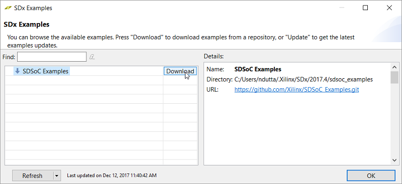

<table style="width:100%">
  <tr>
    <th width="100%" colspan="6"><h1>SDSoC Environment Platform Creation Tutorial</h1>
</th>
  </tr>
  <tr>
    <td align="center"><a href="README.md">Introduction</a></td>
    <td align="center"><a href="lab-1-introduction-to-the-sdsoc-development-environment.md">Lab 1: Introduction to the SDSoC Development Environment</a></td>
    <td align="center"><a href="lab-2-performance-estimation.md">Lab 2: Performance Estimation</a></td>
    <td align="center"><a href="lab-3-optimize-the-application-code.md">Lab 3: Optimize the Application Code</a></td>
    <td align="center"><a href="lab-4-optimize-the-accelerator-using-directives.md">Lab 4: Optimize the Accelerator Using Directives  </a></td>
  </tr>
  <tr>
    <td align="center"><a href="lab-5-task-level-pipelining.md">Lab 5: Task-Level Pipelining</a></td>
    <td align="center"><a href="lab-6-debug.md">Lab 6: Debug</a></td>
    <td align="center"><a href="lab-7-hardware-debug.md">Lab 7: Hardware Debug</a></td>
    <td align="center"><a href="lab-8-emulation.md">Lab 8: Emulation</a></td>
    <td align="center">Lab 9: Installing Applications from GitHub</td>
</table>

## Lab 9: Installing Applications from Github  

This tutorial demonstrates how to install examples that are available on Xilinx Github for the SDx environment.  

First, you install the provided example on Github using the SDx IDE. After the application is installed, you target your design to the desired OS and platform and select the newly installed example application for your design.  

>**:pushpin: NOTE**  You can complete this tutorial even if you do not have a ZC702 board. When creating the SDx project, select your board and one of the available applications, even if the suggested template Emulation application is not found.  

<strong>Step 1: Downloading and Installing an Example from the Github</strong>
  

  1. To download and install an example from the SDx Example store, click Xilinx > SDx Examples.  

       

  2. The SDx Examples dialog box opens up. Click the Download button as shown below.  

       

  3. The examples are installed as shown below.  

       

  4. Click **OK** in the SDx Example Store Dialog box. The example is installed under  
     `<install_area>/Xilinx/SDx/20xx.x/examples`.  

  5. SDx Libraries can also be downloaded in the same fashion.  

<strong>Step 2: Creating a Project to Run the Example</strong>

  1. Select **File > New > SDx Project**.  
  2. In the Project Type page, **Application Project** is selected by default. Click **Next**.  
  3. Specify the name of the project (for example, lab9) in the Project name field. Click New.  
  4. From the Platform list select zc702. Click **Next**.  
  5. From the System Configuration drop-down list, select Linux. Click **Next**.  
  6. From the list of application templates, select Array Partitioning and click Finish.  
  7. Click on the tab labeled lab9 to select the SDx Project Settings (if the tab is not visible, double click the project.sdx file in the Project Explorer). In the HW functions panel observe that the matmul_partition_accel function is marked as a hardware function when the project was created.  
  8. If the hardware functions were removed or not marked, click on the Add HW Functions icon to invoke the dialog box to specify hardware functions.  
  9. Click the Build icon on the toolbar to build the project.      

<strong>Step 3: Running the Application</strong>

  After the build finishes, you can run your application just as you would run any other example as described in the previous chapters.    

### Summary  
After completing this tutorial, you should be able to do the following:

  * Use the SDx IDE to download an example from the Xilinx Github and install it.  
  * Run the example design on your target platform.  

Copyright&copy; 2018 Xilinx

